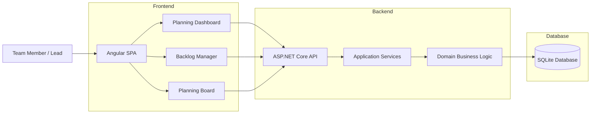
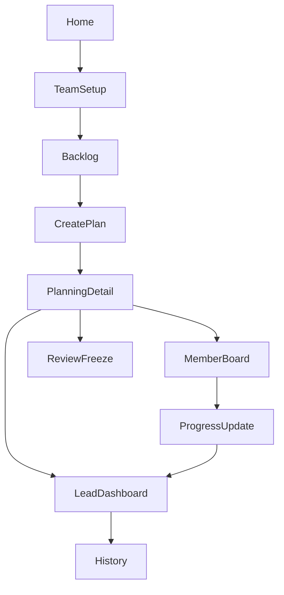
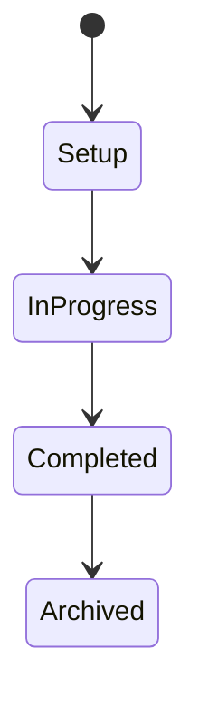
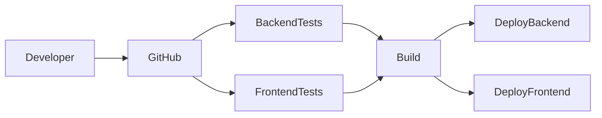

# Weekly Planerz

Weekly Planerz is a **full-stack planning platform designed for engineering teams to organize weekly work, enforce workload limits, and track execution with full visibility**.

The system introduces a **rule-driven planning workflow** where critical planning constraints are validated on the backend, ensuring predictable planning cycles and preventing inconsistent or invalid states.

Built with **Angular 17 and ASP.NET Core 8**, the platform follows **Clean Architecture principles** and is deployed in production using **Vercel and Railway**.

---

# Table of Contents

- **Product Overview**
  - [Overview](#overview)
  - [Problem This Project Solves](#the-problem-this-project-solves)
  - [Live Production System](#live-production-system)

- **System Design**
  - [Repository Structure](#repository-structure)
  - [System Architecture](#system-architecture)
  - [Core Product Modules](#core-product-modules)
  - [Planning Workflow](#planning-workflow)

- **Engineering Details**
  - [Domain Model](#domain-model)
  - [Business Rules](#business-rules)
  - [Technology Stack](#technology-stack)
  - [API Overview](#api-overview)

- **Development & Operations**
  - [Local Development Setup](#local-development-setup)
  - [Testing Strategy](#testing-strategy)
  - [CI/CD Pipeline](#cicd-pipeline)
  - [Deployment Model](#deployment-model)

- **Project Standards**
  - [Engineering Principles](#engineering-principles)
  - [Author](#author)

---

# Overview

Weekly Planerz provides engineering teams with a **structured environment for weekly planning and execution**.

Instead of informal planning using spreadsheets or meetings, the platform introduces a **controlled planning lifecycle** that ensures:

* balanced workload distribution
* transparent ownership of tasks
* consistent planning processes
* reliable execution tracking
* historical planning insights

The system is designed so that **planning rules cannot be bypassed**, since they are enforced in the backend domain layer.

---

# The Problem This Project Solves

Engineering teams frequently encounter planning inefficiencies such as:

* tasks being over-allocated
* lack of clear ownership
* inconsistent planning processes
* limited visibility into execution progress
* planning rules being applied inconsistently

Weekly Planerz addresses these issues by introducing **a rule-enforced planning framework**.

Key guarantees:

* every team member receives exactly **30 hours of planned work**
* planning categories remain balanced
* planning weeks follow a **strict lifecycle**
* frozen plans cannot be modified
* team leads have full execution visibility

---

# Live Production System

The application is deployed and publicly accessible.

| Component             | URL                                                |
| --------------------- | -------------------------------------------------- |
| Frontend              | https://frontend-six-ruby-62.vercel.app            |
| Backend API           | https://api-production-b715.up.railway.app         |
| Swagger Documentation | https://api-production-b715.up.railway.app/swagger |
| Health Monitoring     | https://api-production-b715.up.railway.app/health  |

These endpoints allow reviewers to **explore the system and interact with the API directly**.

---

# Repository Structure

The repository follows a **clear separation between frontend, backend, documentation, and operational configuration**.

```text id="3qolqa"
weekly-planerz
│
├── .github
│   └── workflows
│       ├── backend-ci.yml          # Backend build & test pipeline
│       ├── frontend-ci.yml         # Frontend build & lint pipeline
│       ├── quality-gate.yml        # Pull request validation
│       └── deploy.yml              # Deployment verification workflow
│
├── backend
│   │
│   ├── WeeklyPlanner.API
│   │   ├── Controllers             # REST API endpoints
│   │   ├── Middleware              # Request pipeline middleware
│   │   └── Program.cs              # Application startup
│   │
│   ├── WeeklyPlanner.Application
│   │   ├── Commands                # CQRS command handlers
│   │   ├── Queries                 # CQRS query handlers
│   │   ├── DTOs                    # Data transfer objects
│   │   └── Validators              # FluentValidation rules
│   │
│   ├── WeeklyPlanner.Domain
│   │   ├── Entities                # Core business entities
│   │   ├── Enums                   # Domain enumerations
│   │   └── Rules                   # Business constraints
│   │
│   ├── WeeklyPlanner.Infrastructure
│   │   ├── Persistence             # Database context & migrations
│   │   ├── Repositories            # Data access implementations
│   │   └── Configuration           # Infrastructure configuration
│   │
│   ├── WeeklyPlanner.Tests
│   │   └── Unit tests for domain and application logic
│   │
│   ├── WeeklyPlanner.IntegrationTests
│   │   └── API-level integration tests
│   │
│   └── Dockerfile                  # Backend container configuration
│
├── frontend
│   │
│   ├── src
│   │   ├── app
│   │   │   ├── features            # Feature modules (planning, backlog, team)
│   │   │   ├── core                # Services, interceptors, global utilities
│   │   │   ├── shared              # Reusable UI components
│   │   │   └── store               # State management
│   │   │
│   │   └── environments            # Environment configurations
│   │
│   ├── angular.json                # Angular workspace configuration
│   ├── package.json                # Frontend dependencies
│   └── vercel.json                 # Vercel deployment configuration
│
├── docs
│   ├── architecture.md             # System architecture documentation
│   ├── api-contract.md             # API contract definitions
│   ├── business-rules.md           # Business rule specifications
│   └── reliability-runbook.md      # Operational reliability guide
│
├── diagrams
│   └── Architecture and workflow diagrams
│
├── tests
│   ├── e2e-tests                   # End-to-end testing scenarios
│   └── integration-tests           # Cross-service integration tests
│
├── .gitignore
├── .railwayignore
├── LICENSE
└── README.md
```

This structure keeps the system **modular, scalable, and easy to navigate**.

---

# System Architecture

The system follows a **three-layer architecture** consisting of frontend, backend services, and persistent storage.



All **business rules are validated in the backend domain layer**, ensuring system integrity.

---

# Core Product Modules

| Module          | Purpose                                    |
| --------------- | ------------------------------------------ |
| Planning        | Create and manage weekly planning cycles   |
| Backlog         | Maintain prioritized work items            |
| Team            | Manage team members and planning ownership |
| Dashboard       | Visualize planning progress and execution  |
| Admin Utilities | Import, export, and system utilities       |

---

# Planning Workflow

The following diagram illustrates how a planning cycle progresses through the system.



This workflow ensures **planning is structured and auditable**.

---

# Domain Model

The domain layer defines the **core business entities**.

### BacklogItem

Represents work items available for planning.

Attributes

* category (ClientFocused, TechDebt, RnD)
* estimatedHours
* archive status

---

### PlanningWeek

Represents a weekly planning cycle.

Rules

* can only be created on **Tuesday**
* category allocations must equal **100%**
* frozen plans cannot be modified

---

### PlanEntry

Represents assignment of work to a team member.

Rules

* each member must allocate exactly **30 hours**
* category limits must be respected
* progress is tracked during execution

---

# Business Rules

The backend enforces strict planning constraints.

* planning week creation allowed only on Tuesday
* category allocation must equal 100%
* each member must allocate exactly 30 hours
* frozen weeks cannot be modified
* lifecycle transitions are strictly controlled

Planning lifecycle:



---

# Technology Stack

| Layer        | Technology                |
| ------------ | ------------------------- |
| Frontend     | Angular 17, TypeScript    |
| Backend      | ASP.NET Core 8            |
| Architecture | Clean Architecture + CQRS |
| Messaging    | MediatR                   |
| Validation   | FluentValidation          |
| Logging      | Serilog                   |
| CI/CD        | GitHub Actions            |
| Hosting      | Vercel + Railway          |

---

# API Overview

Main API groups:

| Endpoint        | Purpose                   |
| --------------- | ------------------------- |
| `/api/Planning` | weekly planning lifecycle |
| `/api/Backlog`  | backlog item management   |
| `/api/Team`     | team member management    |
| `/api/Admin`    | system utilities          |
| `/health`       | service health check      |

Example response format:

```json
{
  "success": true,
  "message": "Operation completed",
  "data": {},
  "errors": [],
  "timestamp": "2026-01-01T00:00:00Z"
}
```

---

# Local Development Setup

Prerequisites

* .NET SDK 8+
* Node.js 20+
* npm 10+

Backend

```
cd backend
dotnet restore
dotnet run
```

Frontend

```
cd frontend
npm install
npm run start
```

---

# Testing Strategy

Backend tests

```
cd backend
dotnet test
```

Frontend tests

```
cd frontend
npm run test
```

Continuous integration ensures all builds and tests pass before deployment.

---

# CI/CD Pipeline



---

# Deployment Model

| Component | Platform                 |
| --------- | ------------------------ |
| Frontend  | Vercel                   |
| Backend   | Railway                  |
| Database  | SQLite persistent volume |

Deployment is automated via **GitHub integrations**.

---

# Engineering Principles

The system follows modern engineering standards.

* clean architecture
* domain-driven design
* strict backend validation
* modular scalable structure
* predictable lifecycle transitions
* production monitoring

---

# Author

**Yash Bodad**
Full-Stack Engineer focused on building scalable and reliable systems.
