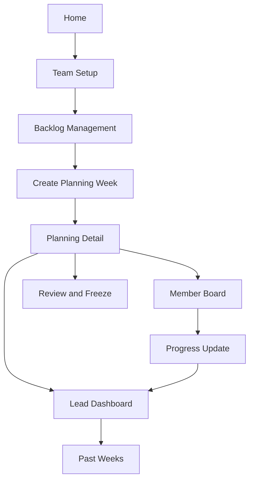
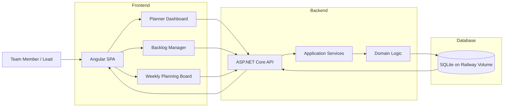

# Weekly Planerz

Weekly Planerz is a full-stack planning platform for engineering teams. It helps leads and members plan weekly work, enforce effort limits, and execute with clear ownership and visibility.

## Project At A Glance

- Frontend: Angular 17 SPA on Vercel
- Backend: ASP.NET Core 8 API on Railway
- Architecture style: Clean Architecture + CQRS
- Goal: predictable planning with strict server-side business rules

## What Is Implemented

- Weekly planning lifecycle from setup to archive
- Backlog management with category-based planning
- Team member role workflows for lead and member views
- Dashboard views for planning status and execution progress
- Health and reliability checks for production monitoring

## Repository Structure

```text
weekly-planerz-main/
├── .github/
│   └── workflows/
│       ├── backend-ci.yml        # Builds and tests backend on every push
│       ├── frontend-ci.yml       # Builds, lints, and tests frontend on every push
│       ├── quality-gate.yml      # Full quality checks on every pull request
│       └── deploy.yml            # Release verification before Vercel/Railway pick up commits
├── backend/
│   ├── WeeklyPlanner.API/        # HTTP API, middleware, startup
│   ├── WeeklyPlanner.Application/# Use-cases, commands, queries, validators
│   ├── WeeklyPlanner.Domain/     # Core business rules and entities
│   ├── WeeklyPlanner.Infrastructure/ # EF Core, repositories, migrations
│   ├── WeeklyPlanner.IntegrationTests/
│   ├── WeeklyPlanner.Tests/
│   └── Dockerfile
├── frontend/
│   ├── src/
│   │   ├── app/                  # Features, core, store, shared
│   │   └── environments/
│   ├── angular.json
│   ├── package.json
│   └── vercel.json
├── docs/
│   ├── README.md
│   ├── architecture.md
│   ├── api-contract.md
│   ├── business-rules.md
│   ├── planning-rules.md
│   └── reliability-30-day-runbook.md
├── tests/
│   ├── README.md
│   ├── e2e-tests/
│   └── integration-tests/
├── diagrams/
│   └── README.md
├── .gitignore
├── .railwayignore
├── LICENSE
└── README.md
```

The `frontend/` and `backend/` folder names are hard-coded in all four CI workflows and must not be renamed or moved.

## Product Modules

| Module | Purpose |
|---|---|
| Planning | Create and manage weekly plans with lifecycle control |
| Backlog | Maintain prioritized work items and category mapping |
| Team | Manage members and planning ownership |
| Dashboard | Track planning and execution visibility |
| Admin Utilities | Seed, export/import, and reset support |

## App Pages (Short Description)

| Page | What You See | How It Works |
|---|---|---|
| Home (`/home`) | Quick summary and navigation entry points | Central landing page for planning, backlog, and team actions |
| Team Setup (`/setup`, `/team/setup`) | Team onboarding and setup form | Creates and updates team foundation data used by planning flows |
| Team Management (`/team`) | Team member list and role controls | Maintains ownership and role boundaries for weekly planning |
| Planning List (`/planning`) | All planning weeks with status context | Entry point to create, review, and execute planning cycles |
| Create/Edit Planning (`/planning/create`, `/planning/:id/edit`) | Planning form with week configuration | Validates setup inputs before persisting planning weeks |
| Planning Detail (`/planning/:id`) | Week-level detail and member allocations | Orchestrates navigation to board, dashboard, review, and progress screens |
| Member Board (`/planning/:weekId/board/:weekMemberId`) | Member task board and allocation view | Member-focused execution board tied to a planning week |
| Lead Dashboard (`/planning/:id/dashboard`) | Lead-level status and progress view | Consolidates team planning and execution health for leadership |
| Review and Freeze (`/planning/:id/review`) | Final review controls before lock | Applies freeze operation to prevent further mutable edits |
| Progress Update (`/planning/:weekId/progress/:weekMemberId`) | Progress update form and completion tracking | Updates execution state for member-week assignments |
| Backlog List (`/backlog`) | Active backlog items and filters | Source of work items used by weekly planning |
| Backlog Create/Edit (`/backlog/create`, `/backlog/:id/edit`) | Backlog item form | Maintains item quality and category integrity |
| Backlog Detail (`/backlog/:id`) | Full item details and lifecycle state | Provides item-level traceability and update context |
| Past Weeks (`/weeks`, `/planning/past`) | Historical planning cycles | Read-focused history for review and operational learning |

## App Flow (Short)



## Production Endpoints

- Frontend: https://frontend-six-ruby-62.vercel.app
- Backend API: https://api-production-b715.up.railway.app
- Swagger: https://api-production-b715.up.railway.app/swagger
- Health: https://api-production-b715.up.railway.app/health

## Hosting Transition

This project was initially hosted on Azure. After Azure sponsorship credits expired, hosting was shifted to Vercel (frontend) and Railway (backend) to maintain stable and cost-effective production operation.

## High Level Architecture



The backend strictly controls business rules while the frontend focuses on user interaction and visualization.

## Architecture Notes

The backend follows layered boundaries:

- Domain: pure business constraints and lifecycle rules
- Application: use-case orchestration and validation flow
- Infrastructure: persistence and external implementation details
- API: transport, middleware, and endpoint surface

The frontend is organized for maintainability:

- features for business screens
- core for services and interceptors
- store for predictable state transitions
- shared for reusable UI parts

## Enforced Business Rules

The following constraints are validated in the backend domain and application layers:

- Planning week can be created only on Tuesday
- Category allocation must sum to 100% (with tolerance handling)
- Member planning must respect the 30-hour policy
- Frozen plans cannot be modified
- Status transitions are controlled (Setup -> InProgress -> Completed -> Archived)

This keeps client-side behavior consistent and prevents invalid state changes.

## Business Value

- Prevents over-allocation with server-validated hour caps
- Enforces controlled planning lifecycle transitions
- Protects approved plans using freeze immutability
- Provides lead/member-specific visibility for weekly execution

## Technology Stack

| Area | Technologies |
|---|---|
| Backend | .NET 8, ASP.NET Core 8, EF Core 8, MediatR, FluentValidation, Serilog |
| Frontend | Angular 17, TypeScript, NgRx, RxJS |
| Delivery | GitHub Actions, Docker, Vercel, Railway |

## API Overview

Core route groups:

- /api/Planning for planning lifecycle and weekly workflow
- /api/Backlog for backlog CRUD and archive operations
- /api/Team for member and role management
- /api/Admin for seed/import/export/reset utilities
- /health for operational health checks

Commonly used routes:

- GET /api/Planning
- POST /api/Planning/{id}/freeze
- GET /api/Backlog/active
- PUT /api/Team/{id}/role
- GET /health

Response format is consistent across endpoints:

```json
{
  "success": true,
  "message": "Operation completed",
  "data": {},
  "errors": [],
  "timestamp": "2026-01-01T00:00:00Z"
}
```

## Local Setup

Prerequisites:

- .NET SDK 8+
- Node.js 20+
- npm 10+
- Docker (optional)

Backend:

```bash
cd backend
dotnet restore
dotnet build
dotnet run --project WeeklyPlanner.API/
```

Frontend:

```bash
cd frontend
npm install --legacy-peer-deps
npm run start
```

## Testing

```bash
# backend
cd backend && dotnet test

# frontend headless
cd frontend && npm run test -- --watch=false --browsers=ChromeHeadless

# frontend coverage
cd frontend && npm run test -- --code-coverage
```

## CI And Delivery

The repository includes four GitHub Actions workflows under `.github/workflows/`.

- `backend-ci.yml` — triggered by any push to `backend/`; restores, builds, and tests the .NET solution
- `frontend-ci.yml` — triggered by any push to `frontend/`; installs, lints, builds, and tests the Angular app
- `quality-gate.yml` — runs on every pull request to `main` or `develop`; enforces strict build health and test pass rate before merge
- `deploy.yml` — runs on every push to `main`; verifies both release builds are valid before Vercel and Railway pick up the commit

Vercel and Railway deploy automatically via their GitHub integrations and do not require secrets or manual workflow steps.

## Deployment And Operations

| Environment | Data Store | API Base URL |
|---|---|---|
| Development | SQLite local file | http://localhost:5000/api |
| Production | SQLite service volume profile | https://api-production-b715.up.railway.app/api |

Daily reliability checks:

- health endpoint returns HTTP 200
- frontend loads without CORS errors
- one create/read UI flow succeeds end to end

Operational focus for the current hosting model:

- Keep Railway runtime variables stable (port, environment, connection string)
- Keep frontend origin aligned with backend CORS policy
- Track /health continuously and respond quickly to failures

## Engineering Standards

- Domain-first business logic
- Inward dependency direction
- Consistent API envelopes and error handling
- Testable command/query flows
- Health-first production operations

## License

All rights reserved.
