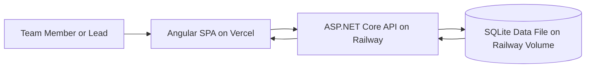
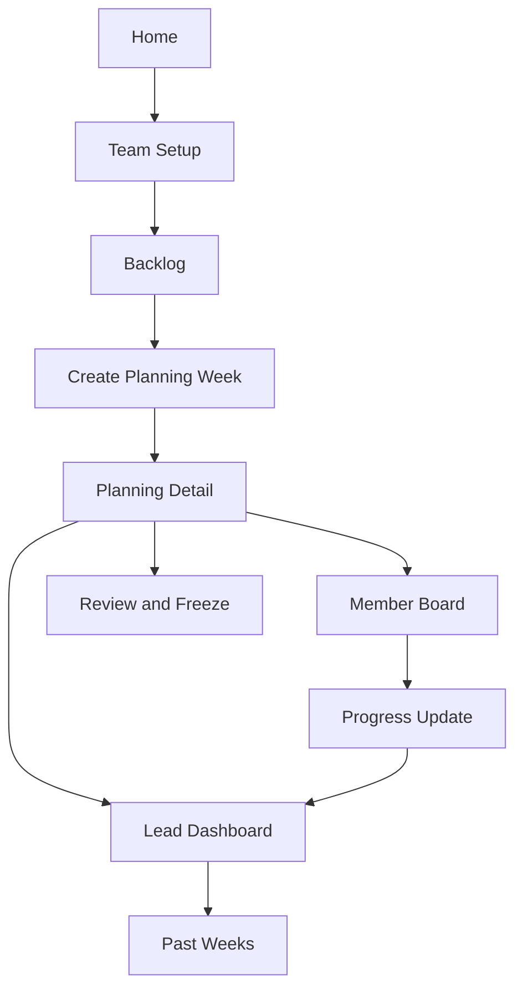

# Architecture

Weekly Planerz uses a split frontend/backend architecture:

- Frontend: Angular SPA hosted on Vercel
- Backend: ASP.NET Core API hosted on Railway
- Data: SQLite (production volume on Railway) with PostgreSQL-ready infrastructure abstractions

## System Diagram (Mermaid)

## Backend Layers

- Domain: business rules and invariants
- Application: CQRS handlers, validation, orchestration
- Infrastructure: EF Core persistence and repository implementations
- API: controllers, middleware, HTTP contracts, health endpoint

## Reliability Principles

- Startup migration retry to avoid crash loops
- Global exception handling in API and frontend
- Consistent API response shape for client resilience
- Health endpoint for operational monitoring

## Application Flow (Mermaid)

